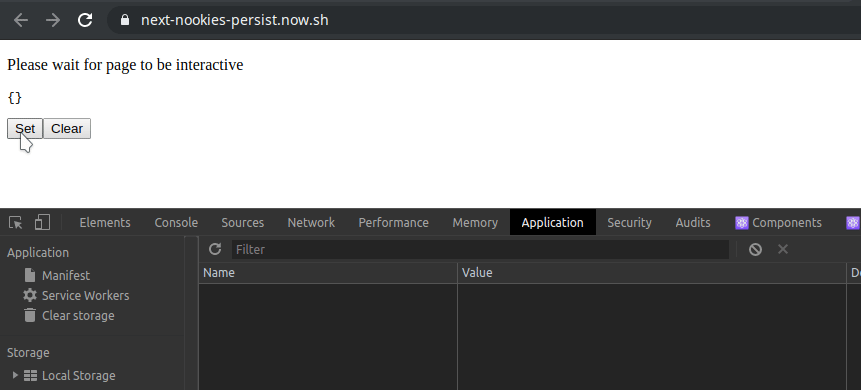

# next-nookies-persist

A simple easy to digest key-value based storage module wrapper for Next.js based on cookies that persists data on page reloads

[Example](https://next-nookies-persist-example.now.sh/)

[](https://github.com/harshzalavadiya/next-nookies-persist/actions)
[](https://npm.im/next-nookies-persist)
[](https://bundlephobia.com/result?p=next-nookies-persist)

> as this package is written in TypeScript documentation is directly available as jsdoc/tsdoc intellisense

## ⚡ Features

- SSR Ready
- Store JSON Out of the box
- Lightweight
- Typed with TypeScript (works with JavaScript too)

## 🔧 Installation

```sh
npm i next-nookies-persist
```

## 📦 Usage

### Configure `pages/_app.js`

```jsx
import App from "next/app";
import React from "react";

import { NookiesProvider, parseNookies } from "next-nookies-persist";

export default class MyApp extends App {
  static async getInitialProps({ Component, ctx }) {
    return {
      pageProps: {
        nookies: parseNookies(ctx), // 👈
        ...(Component.getInitialProps
          ? await Component.getInitialProps(ctx)
          : {})
      }
    };
  }

  render() {
    const { Component, pageProps } = this.props;

    return (
      <NookiesProvider initialValue={pageProps.nookies}> // 👈
        <Component {...pageProps} />
      </NookiesProvider>
    );
  }
}
```

### Use as a react hook inside component `pages/index.js`

```jsx
import React from "react";

import useStorage from "next-nookies-persist";

const Home = () => {
  const { nookies, setNookie, removeNookie } = useStorage();

  return (
    <div>
      <pre>{JSON.stringify(nookies, null, 2)}</pre>
      <button onClick={() => setNookie("foo", { bar: "baz" })}>Set</button>
      <button onClick={() => removeNookie("foo")}>Clear</button>
    </div>
  );
};

export default Home;
```



## 🤠 Credits

- [Nookies](https://github.com/maticzav/nookies)
- [Rollup](https://github.com/rollup/rollup)
- [TypeScript](https://github.com/microsoft/TypeScript)

## 🙏 Contributing

Contributions/Suggestions are always welcome!

## 📄 License

MIT &copy; [harshzalavadiya](https://github.com/harshzalavadiya)
